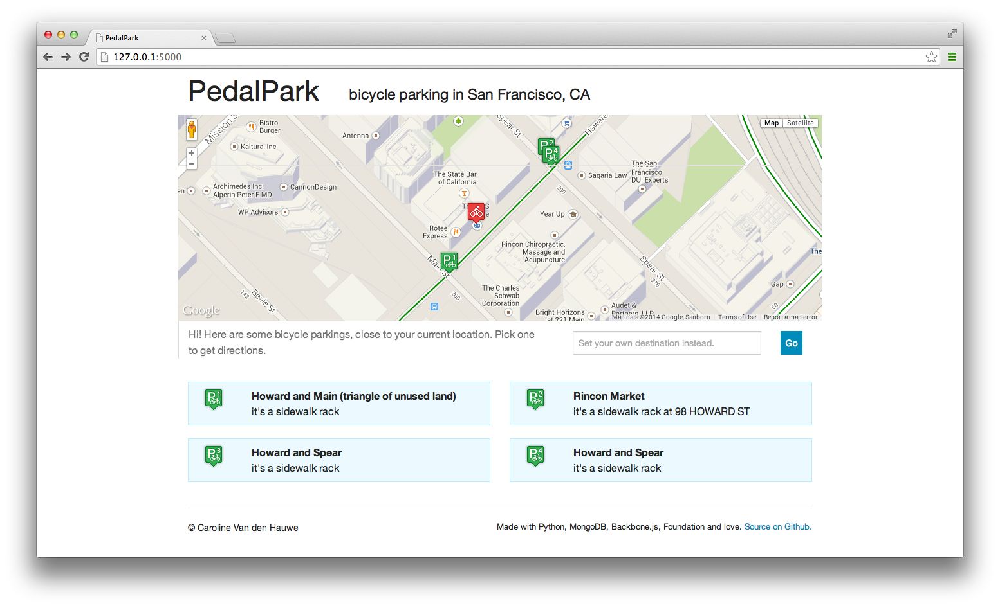
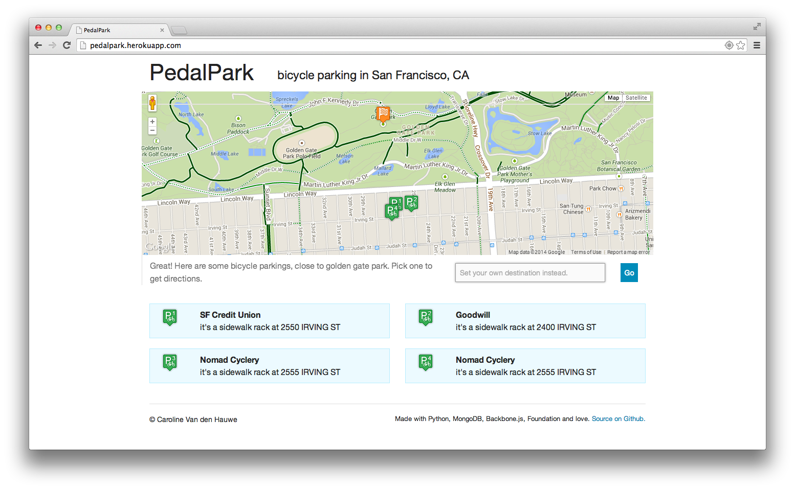
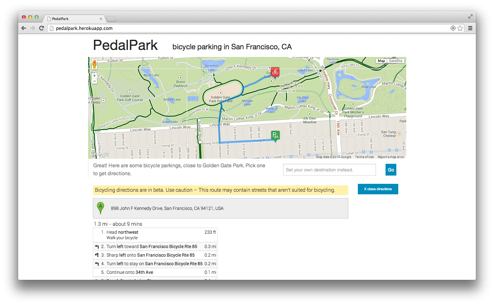

# PedalPark

A web application providing directions to the nearest bicycle parking in San Francisco, CA

##Realisation
PedalPark is a fullstack project.

###Back-end

The back-end is built on the following technologies

- **Python** (no* previous experience, nor with any of the libraries hereunder)
- **MongoDB** (no previous experience), for data caching and Geospatial search of nearest neighbours based on (lat,long).
- **pygeocoder**, a python library easing the usage of Google's Geocoding API.
- **Flask**, for templating and its WSGI container
- **PyMongo**, for MongoDB support.

\* apart from Codecademy :)

The live production environment, **Heroku**, was also entirely new to me.

###Front-end

- **JavaScript** (limited previous experience).
- **Foundation** (no previous experience), for mobile-first design, because cyclists carry small screens.
- **Backbone.js** (no previous experience), for clean MVC software design.
- **Underscore** (no previous experience), for its templating engine.

###Data
All data is provided by [San Francisco 311][1] through their SODA API url at `http://data.sfgov.org/resource/w969-5mn4.json`

####Finding nearest (longitude,latitude) pairs
Finding the nearest bike parking can be done by:

 - Populating a KDTree based on the (long,lat) pair of every bike parking. For this, `scipy.spatial.KDTree` could be used, however all points would have to be converted to 3D space.
 - Brute force traversing all bike parkings and calculating distance using the Haversine formula.
 - **Populating a MongoDB and using its built-in [Geospatial Indexing][2]**.

##Usage

###Run on Localhost

 1. Start a MongoDB server on port `27017` or specify port in `pedalpark/__init__.py`.
 2. Make `pedalpark` your current MongoDB, through `use pedalpark` in the mongo shell. You can change `pedalpark` in `pedalpark/__init__.py` as well.
 3. Start a Python server by running `python runserver.py`.

###PedalPark API call examples

- **`/update`** populates a MongoDB with bike parkings.
- **`/near?lat=37.790947&long=-122.393171&limit=3`** finds the 3 bike parkings closest to the given (lat,long) location.
- **`/near?address=Baker+Beach`** finds the bike parking closest to Baker Beach. It also takes a limit argument, but assumes 1 when omitted.
- **`/all`** returns all known and installed bike parkings.
- **`/size`** returns the amount of known and installed bicycle parkings.

###[Live PedalPark app][3]

## Screenshots
Showing 4 bicycle parking locations closest to your current location: 

   

...Or to a manually set destination:

Rendering drawn and written directions to a parking location of your choosing:

PedalPark is responsive, and works on phones too:

  

## User Guide

---

Things to attend to, given more time

 - Code Quality
 	- Move Backbone MVC's into seperate files using RequireJS
 	- Move HTML templates into seperate files
 	- Unit test Python API
 	- Testing, Testing, Testing
 - UX
 	- Navigation to previous state (tip: choose 'me' as a destination in the input box)
 - UI polish
 - Features
 	- Open turn-by-turn directions in Google Maps for smartphone
 	- In case of manual destination used, draw path from location to parking to destination
 	- Let user pick a location on the map

  [1]: https://data.sfgov.org/Transportation/Bicycle-Parking-Public-/w969-5mn4
  [2]: http://docs.mongodb.org/manual/applications/geospatial-indexes/
  [3]: http://pedalpark.herokuapp.com