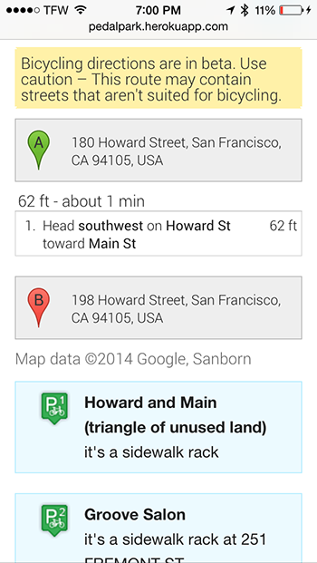

# PedalPark

A web application providing directions to the nearest bicycle parking in San Francisco, CA

##Realisation
PedalPark is a fullstack project.

###Back-end

The back-end is built on the following technologies

- **Python** (no* previous experience, nor with any of the libraries hereunder)
- **MongoDB** (no previous experience), for data caching and Geospatial search of nearest neighbours based on (lat,long).
- **pygeocoder**, a python library easing the usage of Google's Geocoding API.
- **Flask**, for templating and its WSGI container
- **PyMongo**, for MongoDB support.

\* apart from Codecademy :)

The live production environment, **Heroku**, was also entirely new to me.

####Tree with most important files:

    pedalpark
    ├── pedalpark/__init__.py  -> start of Python backend
    ├── pedalpark/data.py      -> a module
    └── pedalpark/location.py  -> a module

###Front-end

- **JavaScript** (limited previous experience).
- **Foundation** (no previous experience), for mobile-first design, because cyclists carry small screens.
- **Backbone.js** (no previous experience), for clean MVC software design.
- **Underscore** (no previous experience), for its templating engine.

Additionally, I use **Grunt** to concatenate all JS files for Backbone Models, Views and Routers into one minified JS file, allowing for clearly seperated files at development time, and one quick loading file at production time.

####Trees with most important files:

    pedalpark/static
    ├── pedalpark/static/css
    ├── pedalpark/static/img
    └── pedalpark/static/js
        ├── pedalpark/static/js/dist
        │   ├── pedalpark/static/js/dist/pedalpark.js
        │   │    -> concat of all files in src/
        │   └── pedalpark/static/js/dist/pedalpark.min.js
        │        -> minimized version of pedalpark.js
        ├── pedalpark/static/js/main.js
        │    -> requirejs configuration, calls startpedalpark.js
        ├── pedalpark/static/js/src
        │   ├── pedalpark/static/js/src/models
        │   │    -> seperate files for Backbone.Model objects
        │   ├── pedalpark/static/js/src/routers
        │   │    -> seperate files for Backbone.Router objects
        │   ├── pedalpark/static/js/src/startpedalpark.js
        │   │    -> entry point, calls first router
        │   └── pedalpark/static/js/src/views
        │        -> seperate files for Backbone.View objects
        └── pedalpark/static/js/vendor

    pedalpark/templates
    └── pedalpark/templates/index.html
         -> html code with templating

###Data
All data is provided by [San Francisco 311][1] through their SODA API url at `http://data.sfgov.org/resource/w969-5mn4.json`

####Finding nearest (longitude,latitude) pairs
Finding the nearest bike parking can be done by:

 - Populating a KDTree based on the (long,lat) pair of every bike parking. For this, `scipy.spatial.KDTree` could be used, however all points would have to be converted to 3D space.
 - Brute force traversing all bike parkings and calculating distance using the Haversine formula.
 - **Populating a MongoDB and using its built-in [Geospatial Indexing][2]**.

##Usage

###Optional: Generate new pedalpark.min.js after edits to src/ files

 1. Install Grunt's Concat: `npm install grunt-contrib-concat`
 2. Install Grunt's Uglify: `npm install grunt-contrib-uglify`
 3. run the provided Gruntfile.js script using `grunt`

###Run on Localhost

 1. Start a MongoDB server on port `27017` or specify port in `pedalpark/__init__.py`.
 2. Make `pedalpark` your current MongoDB, through `use pedalpark` in the mongo shell. You can change `pedalpark` in `pedalpark/__init__.py` as well.
 3. Start a Python server by running `python runserver.py`.

###PedalPark API call examples

- **`/update`** populates a MongoDB with bike parkings.
- **`/near?lat=37.790947&long=-122.393171&limit=3`** finds the 3 bike parkings closest to the given (lat,long) location.
- **`/near?address=Baker+Beach`** finds the bike parking closest to Baker Beach. It also takes a limit argument, but assumes 1 when omitted.
- **`/all`** returns all known and installed bike parkings.
- **`/size`** returns the amount of known and installed bicycle parkings.

###Live PedalPark app

Online at [PedalPark.herokuapp.com][3]

#### Screenshots
Showing 4 bicycle parking locations closest to your current location: 

   

...Or to a manually set destination:

Rendering drawn and written directions to a parking location of your choosing:

PedalPark is responsive, and works on phones as well:

  
                                                        
Additionally, it greets you while it checks for and possibly updates its database: 

And when PedalPark can't locate you automatically, it shows all bicycle parking spots in San Francisco, CA:

---

Things to attend to, given more time

 - Code Quality
    - ~~Move Backbone MVC's into seperate files using~~ ~~RequireJS~~  ~~Grunt~~
    - Move HTML templates into seperate files
    - Unit test Python API
    - Testing, Testing, Testing
 - UX
    - Navigation to previous state (tip: choose 'me' as a destination in the input box)
 - UI polish
 - Features
    - Open turn-by-turn directions in Google Maps for smartphone
    - In case of manual destination used, draw path from location to parking to destination
    - Let user pick a location on the map

  [1]: https://data.sfgov.org/Transportation/Bicycle-Parking-Public-/w969-5mn4
  [2]: http://docs.mongodb.org/manual/applications/geospatial-indexes/
  [3]: http://pedalpark.herokuapp.com